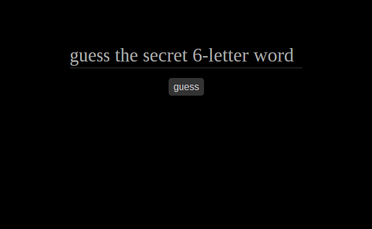
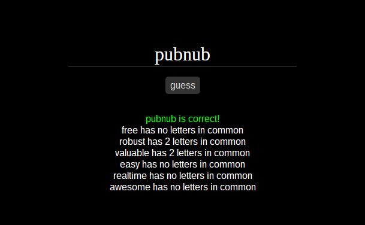

real-time multiplayer guess-the-word game created with [PubNub](http://pubnub.com/) and [AngularJS](https://angularjs.org/). demo at [alamo-rubber.codio.io/app/index.html](http://alamo-rubber.codio.io/app/index.html)

This game was inspired by the pencil-and-paper game [Jotto](https://en.wikipedia.org/wiki/Jotto) that my friend showed me when he implemented it on his game site. I put a twist on it by making it collaborative with an arbitrary number of players. Everyone tries to guess the same secret word. Anyone can guess a word at any time, and everyone will see the resulting clue, which tells you the number of letters the guess has in common with the secret word.

I tried to make it as clean and easy to jump in as possible. There is no need to create a game, pick a game to enter, or select a username. Upon opening the page, you are automatically put in the game and can immediately start guessing.

When playing, I suggest you still use some scratchpad to keep track of letters you've eliminated or confirmed through logical deduction. Most digital implementations of Jotto include a letter tracker in-game; I just haven't had time to implement it here yet.

entered into the [PubNub Multi-Player Game App Challenge](http://pubnubgame.challengepost.com). [demo video here](https://www.youtube.com/watch?v=tC0_Y2BJ8oM)

Copyright Daniel Smith. All rights reserved.
